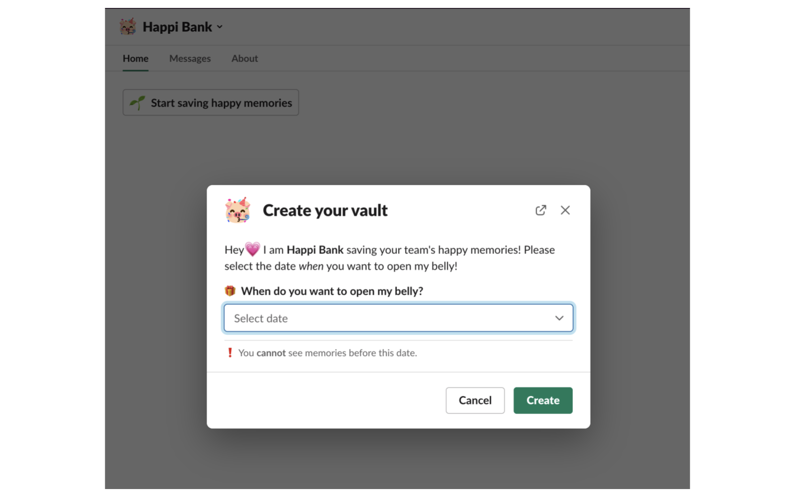
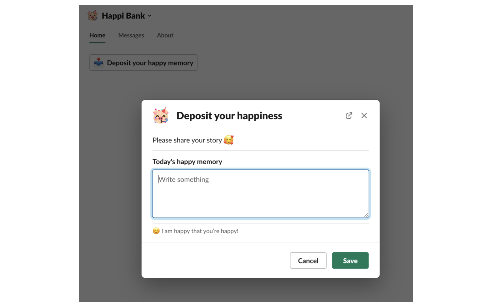
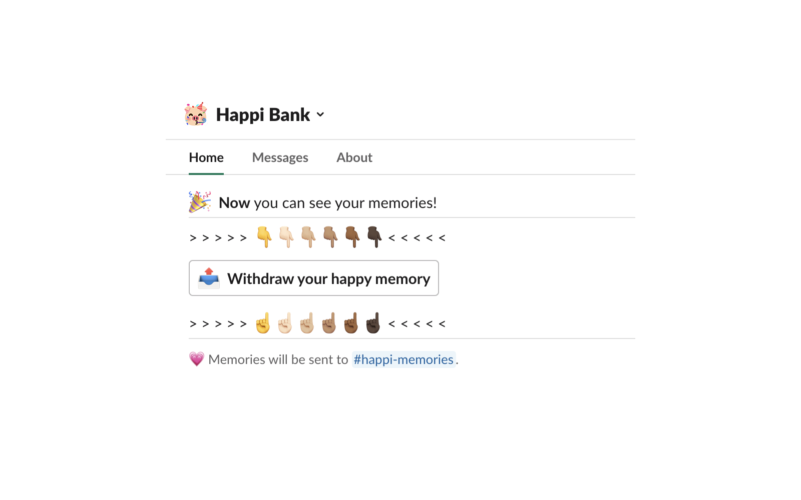
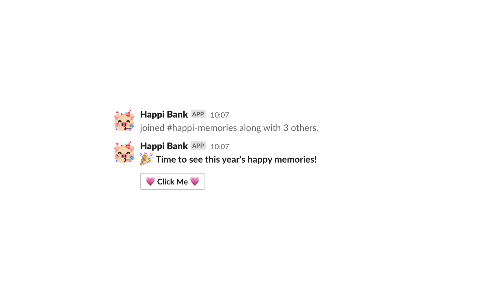

# Add Happi Bank to Slack

   
# About Happi Bank

## 👋 Hello! 안녕!

Invest in your own Happi Bank! Write short stories or messages and enter them into your bank. Set a date, and when it comes round crack open the bank and read your & your teammates' memories!

## 🎊 How to use

1. Add to your slack workspace

2. Create your bank

3. Deposit your happy memories whenever you want

4. Open the bank at the end of the year and have fun with your teammates reviewing your whole happy memories of this year!

## 🚨 Support

> Mail to `jihyojeon7@gmail.com`  
> Twitter DM to `@Yoyojeon1`
